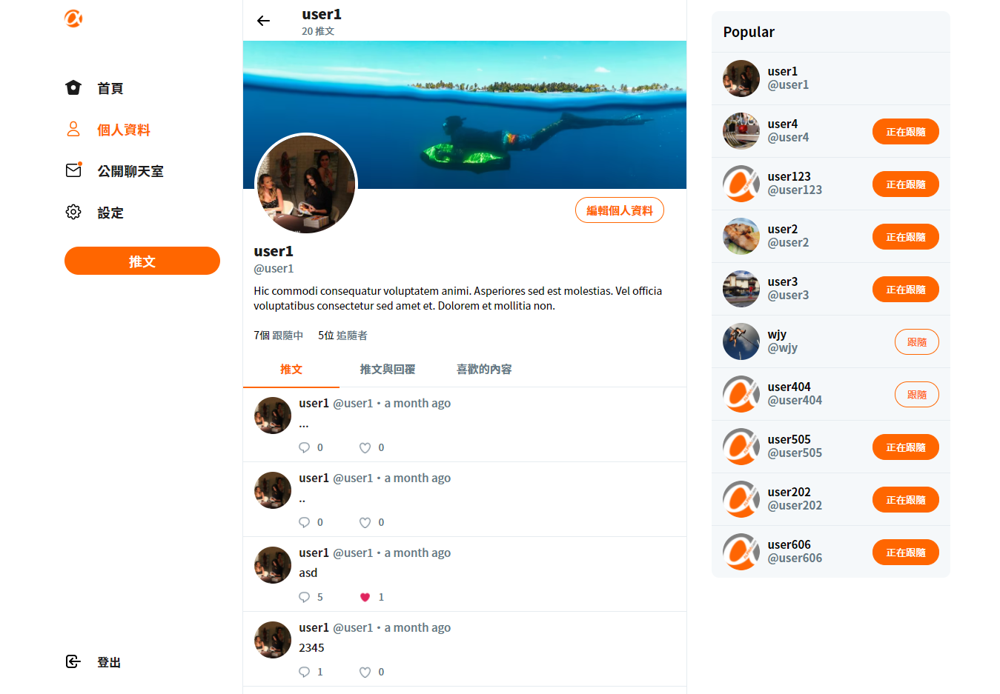

# twitter-front-end-vue

## 概述:
這是一個使用前後分離開發方式的一個簡易版twitter,<br>
在前端方面主要使用的技術是vue.js<br>
你可以在上面瀏覽不同使用者的推文,<br> 
並且追蹤它們, 快來試試吧!!<br>
[前往](https://danielgg1024.github.io/twitter-front-end-vue/#/login)

## 功能
* 註冊/登入/登出你的帳號
* 發送/按讚/留言/回覆貼文
* 追蹤/取消追蹤其他使用者
* 瀏覽個人/他人基本資料
* 修改自身名稱、封面圖片、大頭貼、自我介紹，以及帳號密碼設定
* 後台人員可以瀏覽所有貼文，且刪除某則貼文
* 後台人員可以瀏覽所有的使用者


## 安裝

```
git clone https://github.com/DanielGG1024/twitter-front-end-vue.git
```
```
npm install 
```
```
npm run serve
```
## 測試帳號

**前台登入**<br>
帳號:
```
user1@example.com
```
密碼:
```
12345678
```
**後台登入**<br>
帳號:
```
root@example.com
```
密碼:
```
12345678
```
